# Open Inline v3 — Architecture Diagrams

Companion to `ARCHITECTURE_v3.md`. Source is **PlantUML**; rendered SVGs embedded below and in
`docs/diagrams/`. Regenerate after edits with `scripts/render_diagrams.sh`.

Legend: **solid** = data path · **dashed** = control path · green = proven/open · yellow = spike/gate ·
red = proprietary/not-needed · blue = future/stretch.

Diagrams 1–5 are **Phase 1** (no CXL, buildable now). Diagram 6 is **Phase 2** (locked scope, CXL
swaps the GPU→CPU leg only — not built yet).

---

## 1. [Phase 1] Architecture — complete L1 on GPU (data path, no CXL)

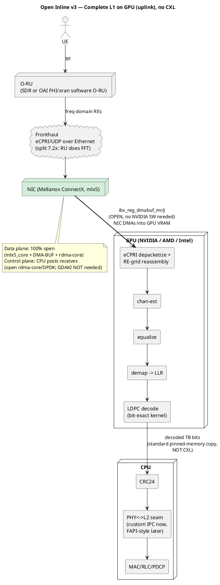

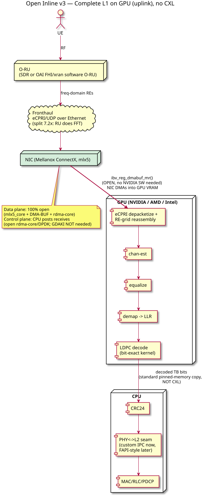

---

## 2. [Phase 1] Split choice — why 7.2x, not split 8

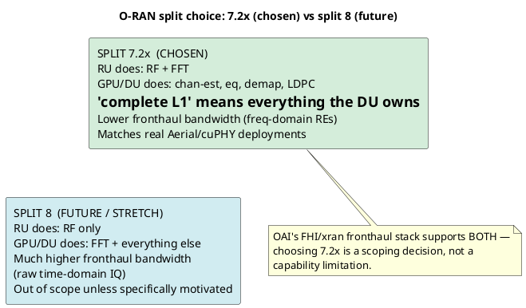

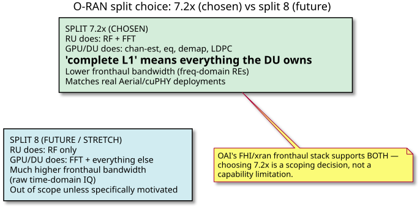

---

## 3. [Phase 1] Open NIC->GPU mechanism — layer by layer

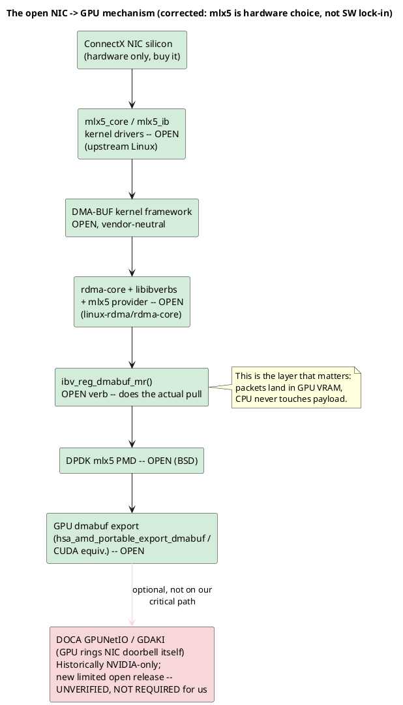

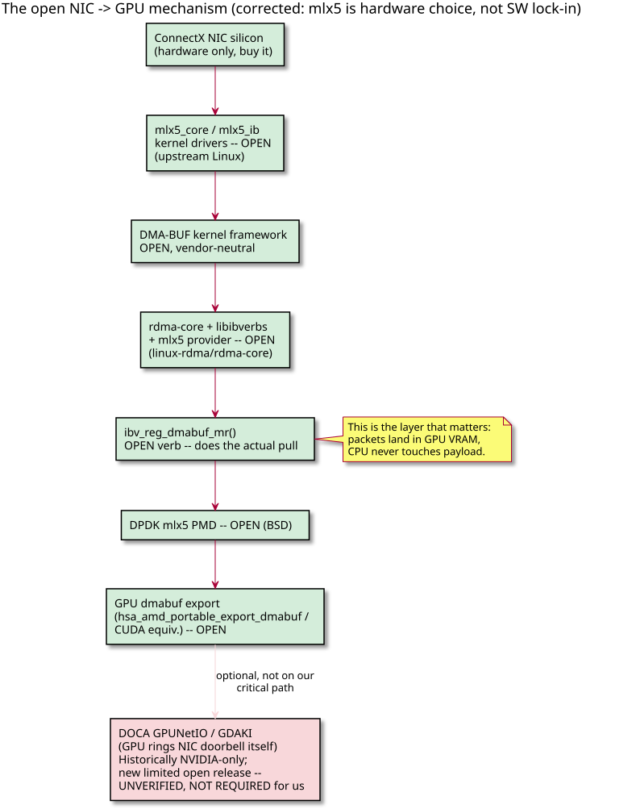

---

## 4. [Phase 1] Hardware staging plan (mechanism -> PHY -> portability -> live)

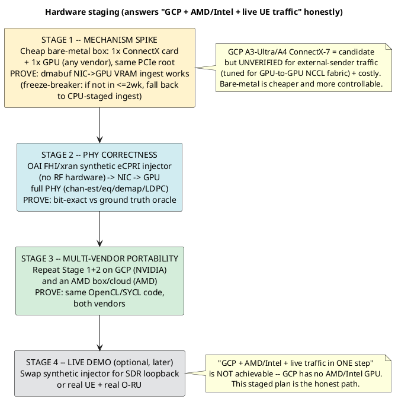

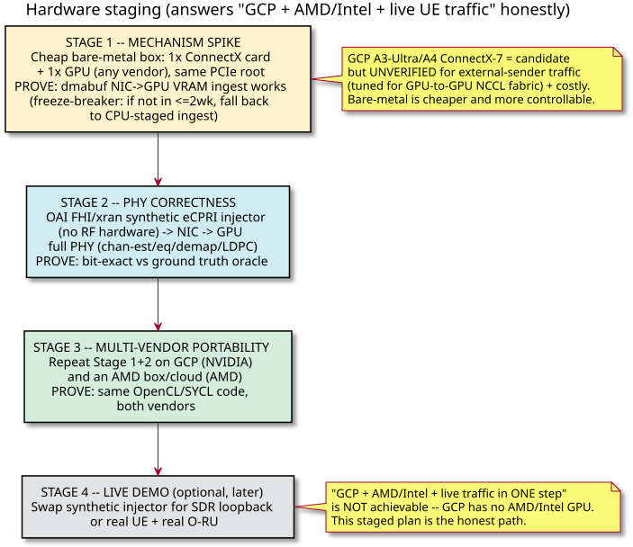

---

## 5. [Phase 1] PHY<->L2 seam — structural change from v1/v2

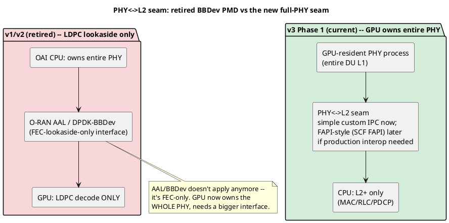

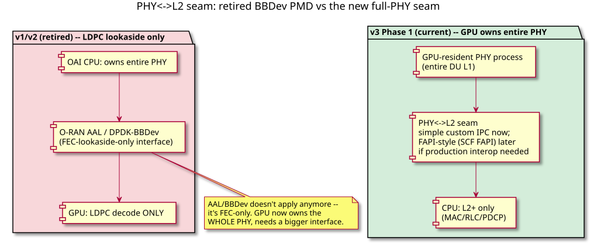

---

## 6. [Phase 2, locked scope] CXL swaps the GPU→CPU leg only

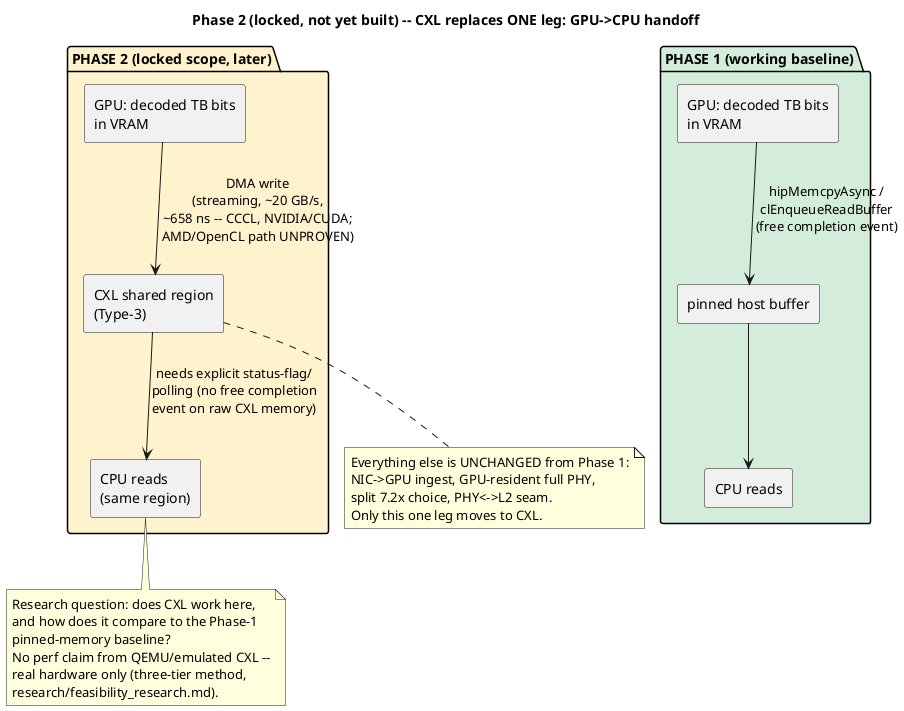

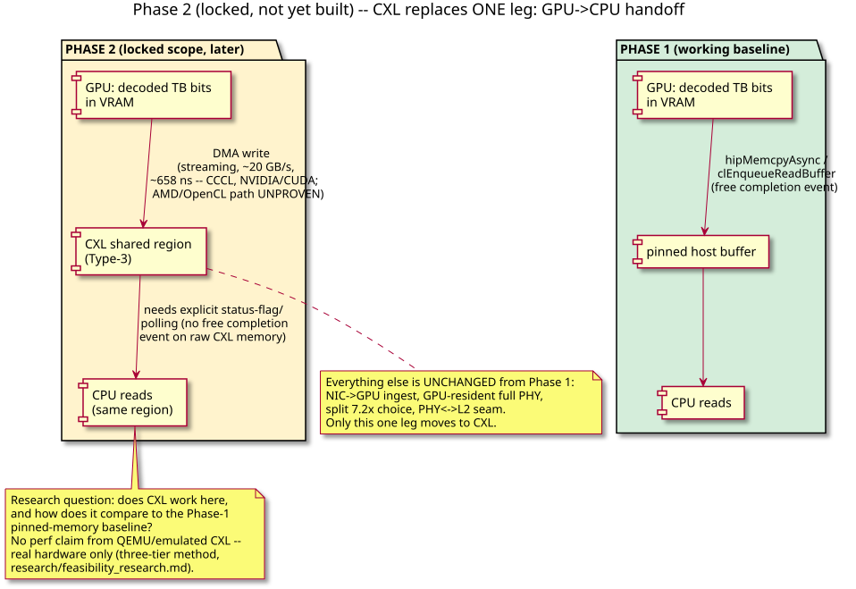

---

## Rendering
`./scripts/render_diagrams.sh` regenerates all SVG+PNG from the blocks above. If a diagram and
`ARCHITECTURE_v3.md` disagree, the text wins — update the diagram.
