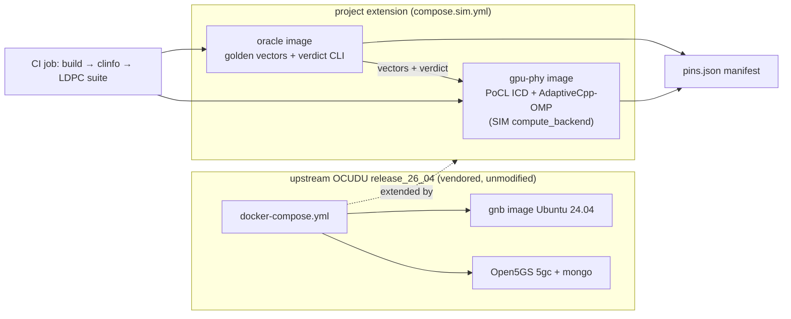

# p0-rig-scaffold — HLD

> **PIN UPDATE (2026-07-19, propagated to this file 2026-07-21):** upstream is **OCUDU**
> (`gitlab.com/ocudu/ocudu`, `release_26_04`, BSD-3) — the successor to srsRAN Project. See
> `../../../research/ocudu_repin.md`. Every "srsRAN"/"srsran" reference below now reads "OCUDU".

Companion to [`SPEC.md`](SPEC.md). Requirement IDs P0-R1…R9 referenced throughout.

## Context diagram



Hosts (SIM §1): WSL2 (primary dev loop) and GCP `n2-standard-16` — same compose files, zero
changes. PHYSICAL boxes later reuse the identical artifact with backend swaps only.

## Components

| Component | Role | Reqs |
|---|---|---|
| **Upstream vendored tree** | `docker/upstream/` copy of OCUDU (`gitlab.com/ocudu/ocudu`) `release_26_04` compose assets; never edited; provenance in pins. | P0-R1 |
| **Compose override** (`compose.sim.yml`) | Adds `gpu-phy` + `oracle` services; upstream services untouched. Later phases layer further overrides on the same base. | P0-R2 |
| **gpu-phy image** | Skeleton SIM PHY container: PoCL ICD, AdaptiveCpp (OMP), clinfo, LDPC suite. Unprivileged, no devices. Platform chosen by `OI_CL_PLATFORM`. | P0-R3/R4/R6 |
| **oracle image** | Golden-vector store + verdict CLI. In P0 holds LDPC vectors only; directory layout is the P2 per-kernel extension point. | P0-R5 |
| **Pins generator** | Build-time step writing `pins.json`, stamped as an OCI label and exported as artifact. | P0-R7 |
| **CI job** | Cold build of all images, then in-container assertions (clinfo, suite). | P0-R8 |
| **Bring-up smoke helper** | Script wrapping `docker compose up` + health/stability/log checks + SCTP precondition. | P0-R9 |

## Interfaces (every boundary named)

1. **`IF-P0-COMPOSE`** — the compose file set `{upstream/docker-compose.yml, compose.sim.yml}`.
   Consumed by p1 (adds networks/services via further overrides) and p5 (deploy artifact).
2. **`IF-P0-CLPLATFORM`** — env contract `OI_CL_PLATFORM` (`pocl` in SIM; vendor values in
   PHYSICAL per SIM §3.1). Any process in `gpu-phy` selects its OpenCL platform through this
   single variable. This *is* the compute_backend swap seam.
3. **`IF-P0-VECTORSTORE`** — oracle image filesystem layout for golden vectors
   (`/oi/vectors/<kernel>/<case-id>/…`, see LLD). p2 adds kernels; p0 populates `ldpc/` only.
4. **`IF-P0-VERDICT`** — oracle verdict CLI: result blob + case ID in → PASS/FAIL + verdict JSON
   out. Used by CI in P0, by p2 gates, and by p5's assertion scripts.
5. **`IF-P0-PINS`** — `pins.json` schema (LLD §Configuration). Read by p5's ledger.
6. **`IF-P0-SUITE`** — LDPC suite invocation contract: one entrypoint, exit 0 = 0 mismatches;
   machine-readable summary on stdout (pre-existing suite behavior, wrapped not modified).

## Data flow

P0 has no RAN data path. The only data flow is the test flow:

```
CI/host ── docker compose run gpu-phy <suite entrypoint>
   gpu-phy: clinfo → assert PoCL platform (IF-P0-CLPLATFORM)
   gpu-phy: LDPC suite reads vectors (IF-P0-VECTORSTORE, mounted from oracle image volume
            or baked-in copy — see LLD) → runs kernels on PoCL → summary
   oracle:  verdict CLI checks summary/blobs → PASS/FAIL JSON (IF-P0-VERDICT)
```

`docker compose up` (P0-G2) exercises only upstream flows: gnb starts, dials the AMF
(NGAP/SCTP) on the upstream compose network; no fronthaul exists yet.

## Deployment view

| Where | What runs | Tier |
|---|---|---|
| WSL2 host | compose bring-up smoke, suite runs during dev | SIM |
| GCP `n2-standard-16` | identical compose + suite (proves no host-kernel accident, SIM §4 DoD) | SIM |
| CI runner (docker-capable) | image builds + P0-G1/G3 assertions; P0-G2 optional in CI if the runner kernel has SCTP | SIM |
| PHYSICAL boxes (later) | same `gpu-phy` image + vendor ICD + `/dev/kfd`,`/dev/dri`,`/dev/infiniband` mounts + `OI_CL_PLATFORM` flip — **no rebuild of project code** | via p5/p6 |

## Design decisions (with rationale)

1. **Vendor upstream compose, extend by override, never edit** — keeps the OCUDU fork surface
   zero at P0; upgrades are re-vendors; P0-R2's "rendered upstream diff empty" makes drift
   detectable mechanically. (Upstream is OCUDU, `gitlab.com/ocudu/ocudu`, `release_26_04` — the
   successor to srsRAN Project, re-pinned 2026-07-19: `research/ocudu_repin.md`.)
2. **PoCL as the SIM compute_backend device swap (no GPU simulator)** — SIM §3.1 verbatim:
   preserves kernel semantics/host API/integer bit-exactness; deliberately does not preserve warp
   width (enforces the no-warp-assumption kernel rule).
3. **AdaptiveCpp OMP backend baked in from P0** even though P0 runs only OpenCL-C LDPC — the SYCL
   side of the kernel rules (SIM §3) must be installable-and-pinned before p2 starts, or p2 would
   churn the base image.
4. **LDPC suite lives in `gpu-phy`, verdict lives in `oracle`** — the thing that needs OpenCL runs
   where OpenCL is; the thing that owns truth (vectors, verdicts) is a separate image so p2/p3/p5
   can trust it independently of the code under test.
5. **Unprivileged, deviceless `gpu-phy`** — proves the SIM tier genuinely needs no hardware access
   (SIM §3.1 "No /dev mounts, no privileges"), and makes the PHYSICAL delta an explicit,
   reviewable overlay (p5's delta-lint).
6. **Pins as image labels + artifact** — SIM §2: "parity comes from the images, not the host";
   a manifest that travels with the image is auditable on any box, day 1.

## Rejected alternatives

- **QEMU/VM-based SIM tier** — rejected by SIM §1 (TCG timing artifacts; containers give native
  speed and the bridge "wire" for free).
- **GPU functional simulators** — rejected by SIM §3.1 ("No GPU simulator — a device swap").
- **Building OCUDU images from scratch** — upstream already ships pinned Ubuntu 24.04 images and
  a compose; re-authoring them adds fork burden with zero proof value at P0.
- **Modifying the LDPC suite to "fit" the container** — the suite's value is that it is the
  already-bit-exact prior artifact; any modification would invalidate that inheritance (P0-R6).
- **Putting vendor ICDs in the SIM image now** ("one fat image") — bloats the deviceless claim and
  hides the backend seam; PHYSICAL adds ICDs by overlay instead (SIM §3.1).
