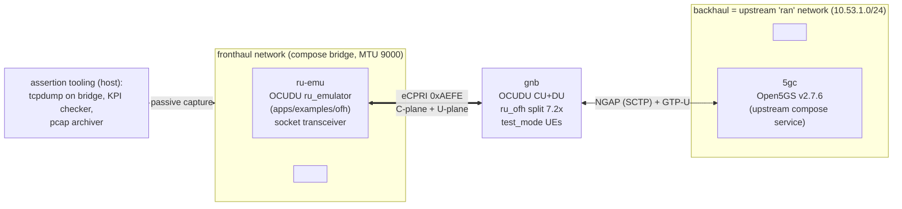

# p1-ran-baseline — HLD

Companion to [`SPEC.md`](SPEC.md). Requirement IDs P1-R1…R12 referenced throughout.
Grounding: all upstream facts below verified against the local clone
`/root/linux_env/cxl/third_party/ocudu` (tag `release_26_04`).

## Context diagram



The `gnb` container is dual-homed: `fronthaul` (OFH cell interface) + `ran` (AMF/UPF) + upstream
`metrics` (kept as upstream ships it). `ru-emu` is single-homed on `fronthaul`. `5gc` is untouched.

## Components

| Component | Role | Reqs |
|---|---|---|
| **`compose.p1.yml` overlay** | Adds `fronthaul` network + `ru-emu` service; additively extends `gnb` (network join); selects gNB config through upstream env hooks (`GNB_CONFIG_PATH`). | P1-R1/R2/R3 |
| **`ru-emu` service** | Upstream image, `COMPONENT=ru-emulator` build target of `docker/Dockerfile` (verified: builds `apps/examples/ofh/ru_emulator`). Socket transceiver at runtime. | P1-R4 |
| **`gnb` service (upstream)** | Unmodified `ocudu/gnb` image; config = `ru_ofh` cell + `test_mode` (upstream `configs/testmode.yml` pattern). | P1-R5/R7 |
| **`5gc` service (upstream)** | Open5GS + subscriber DB as shipped; healthcheck as shipped. | P1-R7 |
| **Rig configs** | `ru_emu.yml`, `gnb_ofh_testmode.yml` — pure YAML, values cross-consistent per the fronthaul plan (below). | P1-R5 |
| **Assertion tooling** | `check_sctp.sh` (shared with p0), `assert_ecpri.sh` (capture+classify), `soak_stability.sh` (10-min checker), `archive_pcap.sh` (corpus + manifest). Host-side only. | P1-R6/R8/R9/R10/R11/R12 |

## Interfaces (every boundary named)

1. **`IF-P1-COMPOSE`** — the overlay stack `{p0 base} + compose.p1.yml`. Consumed by p3 (adds its
   patched-ru-emu/gpu-phy overlay on top) and p5 (P1 session definition).
2. **`IF-P1-FRONTHAUL`** — the fronthaul wire contract: network name `fronthaul`, bridge MTU 9000,
   members {ru-emu, gnb}, MAC/VLAN/eAxC plan (LLD §Data structures). p3's tap and injection bind to
   exactly this contract.
3. **`IF-P1-RIGCFG`** — the config pair (`ru_emu.yml`, `gnb_ofh_testmode.yml`) + the
   cross-consistency rules between them (LLD). p3 extends `ru_emu.yml` with injection keys; the
   cell parameters here are the pinned rig configuration p2/p3 vectors must match.
4. **`IF-P1-ASSERT`** — assertion script CLI contract (exit 0/1/2/3 semantics identical to p0;
   one-line JSON verdict on stdout). Wrapped, not redefined, by p5's suite contract.
5. **`IF-P1-PCAPS`** — pcap corpus layout + manifest schema (LLD). The replay input for p2's
   integration gate and p3's U3 unit gate.
6. **`IF-P1-KPI`** — the definition of "KPIs clean" (P1-G1) and the stability criteria (P1-R9):
   which counters, where read from (gnb stdout JSON metrics via upstream
   `autostart_stdout_metrics`/`enable_json`; ru_emulator stdout KPI table), and the functional-only
   rule. p3-R12 reuses this as its DU-undisturbed baseline.

## Data flow

```
5gc healthy ──► gnb starts (upstream depends_on) ──► NG Setup over ran/SCTP (P1-R7)
gnb DU ──► OFH C-plane (type 2) + DL U-plane (type 0), 0xAEFE ──► fronthaul bridge ──► ru-emu
ru-emu ──► UL U-plane (type 0) static IQ (+ dummy PRACH per config) ──► gnb DU
gnb MAC test_mode ──► UL/DL MAC traffic to emulated UEs ──► counters in stdout JSON metrics
host tooling: tcpdump -i <bridge> ──► classifier ──► per-plane/per-direction counts ──► gate verdict
             pcap rotation ──► corpus + manifest (IF-P1-PCAPS)
```

No project process touches a single frame: capture is passive on the host-side bridge interface.

## Deployment view

| Where | What runs | Tier |
|---|---|---|
| WSL2 host | full rig + assertions (after `check_sctp.sh` passes; else expected-blocked exit 3) | SIM |
| GCP `n2-standard-16` | identical compose + assertions (SIM §4 DoD; stock kernel has SCTP) | SIM |
| CI runner | rendered-config assertions (R1/R2/R3/R11 static checks) always; full P1-G2 only on an SCTP-capable runner | SIM |
| PHYSICAL boxes | not this feature — the rig recurs there only via p5's deploy unit | — |

## Design decisions (with rationale)

1. **D1 — Base on the monolithic `docker-compose.yml`, not `docker-compose.split.yml`.**
   Evaluated per `research/ocudu_repin.md` §4. Decision: **monolithic** for P1 (and as the p5
   deploy-unit default), split retained as a vendored, documented alternative to re-evaluate at p4.
   Rationale: (a) SIM §2's normative topology is a single `gnb` container ("srsRAN CU+DU,
   test-mode UEs") — the P1 gate lives entirely on the fronthaul side and gains nothing from CU/DU
   separation; (b) the split compose adds two more SCTP-dependent services (E1AP/F1AP listeners are
   its healthcheck conditions — verified in `docker-compose.split.yml`), multiplying the WSL2 SCTP
   risk surface and the 10-minute-soak failure modes for zero additional proof value at P1;
   (c) test-mode + `ru_ofh` reference configs upstream target the `gnb` app; the split DU config
   (`du_rf_b200_tdd_n78_20mhz.yml` default) would need more config surgery, against P1's
   zero-project-code spirit; (d) fewer images to build/pin on the P1 critical path. What would
   flip it: p4's seam work benefiting from a separate DU process, or upstream deprecating the
   monolithic gnb — both re-evaluated in p4's spec, not here.
2. **D2 — Socket transceiver, not DPDK-virtio, for ru-emu on the containerized bridge.**
   `ru_emulator` selects DPDK only when `dpdk_config` is present (verified,
   `ru_emulator.cpp:984-1022`); omitting it yields the socket (AF_PACKET) transceiver. Chosen
   because: (a) it runs on a plain compose veth with no hugepages, no `--privileged`, no EAL/PMD
   setup — matching SIM §1's "no exotic host config" and keeping WSL2 first-class; (b) it is
   mechanism-homologous with the SIM `ingest_backend` (af_packet, SIM §3) — one wire discipline
   across P1/P3; (c) DPDK on a bridge needs virtio-user/af_packet PMD plumbing whose only payoff is
   throughput, which SIM is forbidden to claim (SIM preamble). DPDK stays the PHYSICAL-tier
   transceiver (p6). Note: the image is still *built* with DPDK enabled (upstream
   `builder-component-dpdk` stage) — unused at runtime; this is upstream's build shape, not a rig
   dependency.
3. **D3 — Fronthaul as a dedicated new network; upstream `ran` reused as backhaul.** The
   architecture names two networks ("fronthaul"/"backhaul", SIM §2); upstream ships `ran` +
   `metrics`. Renaming `ran` would edit upstream (violates P1-R1), so `ran` *is* the backhaul role,
   recorded here and flagged upward as a naming mismatch. `fronthaul` is new, project-owned, MTU
   9000 (headroom for large U-plane sections regardless of cell bandwidth choice).
4. **D4 — Static MAC plan over promiscuous-everything.** OFH configs demand explicit
   `ru_mac_addr`/`du_mac_addr` (verified in upstream `gnb_ru_*.yml` and
   `ru_emulator_appconfig.h`). Compose-pinned per-service `mac_address` on the fronthaul endpoint
   keeps bridge unicast forwarding honest and makes captures deterministic (classifier keys on
   these MACs). Fallback if compose MAC pinning misbehaves on a host: `enable_promiscuous: true`
   on ru-emu + documented bridge flood behavior (LLD Open questions Q2).
5. **D5 — 20 MHz TDD n78 single cell.** Smallest upstream-blessed OFH cell shape
   (`gnb_ru_picocom_scb_tdd_n78_20mhz.yml` lineage): minimizes CPU load on WSL2 and pcap size,
   while the MTU-9000 bridge keeps the door open for wider cells later without network changes.
   Cell shape is part of `IF-P1-RIGCFG` — p2/p3 vector generation binds to it.
6. **D6 — Functional-only KPI definition.** SIM §4's "KPIs clean" is undefined upstream of this
   spec; ru_emulator's headline KPIs are rx-window timing (early/on-time/late) — timing-flavored
   and thus ineligible for SIM gating. P1 gates only on *counters that count function*: frames
   received per eAxC, MAC traffic totals, restart counts, ERROR-log deltas (P1-R9, P1-R12).
   Flagged upward as a doc gap in SIM §4.
7. **D7 — Capture on the host bridge interface, not in-container.** Keeps P1-R11 (zero project
   code in containers) clean, needs no `cap_add` changes to upstream services, and sees both
   directions at one point. p3 later moves tapping *into* `gpu-phy` (its `ingest_backend`) — P1's
   host capture is assertion tooling, not a backend precursor.

## Rejected alternatives

- **`docker-compose.split.yml` as P1 base** — see D1; rejected for P1, not forever: re-evaluation
  is explicitly assigned to p4 (seam) where DU-process isolation may earn its extra moving parts.
- **DPDK transceiver with virtio-user/af_packet PMD** — see D2: adds privileged/hugepage host
  demands for a throughput benefit SIM must not measure.
- **srsUE/real UE attach at P1** — upstream test-mode exists precisely to avoid RF/UE complexity;
  a protocol-attached UE adds an RF-or-ZMQ chain and NAS surface with no bearing on the P1 gate
  (eCPRI on the wire). Deferred indefinitely; not on any phase's critical path (SIM §2 topology).
- **`network_mode: host` for gnb ↔ 5gc** (upstream README's "easiest" option) — destroys the
  two-network topology and the bridge capture point; rejected.
- **Editing the vendored upstream compose in place** — violates p0's drift-detection design
  (P0-R2) and P1-R1; overlays only.
- **Gating on ru_emulator rx-window timing KPIs** — timing = perf-adjacent; forbidden (D6, P1-R12).
