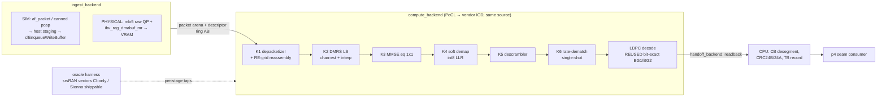

# p2-phy-kernels — HLD

**Scope:** design of the six-kernel portable GPU UL PUSCH pipeline ([`SPEC.md`](SPEC.md)).
Kernel rules + backend vocabulary: [`ARCHITECTURE_v3_SIM.md`](../../../ARCHITECTURE_v3_SIM.md) §3.
Port legality: [`../../../research/use_case_classification.md`](../../../research/use_case_classification.md) §0.1.

## 1. Context diagram

## 2. Components

| Component | Kind | Origin |
|---|---|---|
| `k1_depacketizer.cl` | device kernel, **fresh (T4)** | O-RAN CUS U-plane spec; cuPHY read-only reference; OCUDU `lib/ofh/serdes/ofh_uplane_message_decoder_*` as CPU field-semantics reference (BSD, legal to consult/port parsing logic) |
| `k2_chanest.cl` | device kernel, T3 port | `lib/phy/upper/signal_processors/pusch/dmrs_pusch_estimator_impl.*` + `lib/phy/upper/signal_processors/channel_estimator/port_channel_estimator_average_impl.*`, `port_channel_estimator_helpers.*`, `lib/phy/support/interpolator/interpolator_linear_impl.*` |
| `k3_equalizer.cl` | device kernel, T3 port | `lib/phy/upper/equalization/channel_equalizer_generic_impl.*` (MMSE 1×N specialization, N=1; `equalize_zf_1xn.h` structure as the scalar template) |
| `k4_demapper.cl` | device kernel, T3 port | `lib/phy/upper/channel_modulation/demodulation_mapper_impl.*` + `demodulation_mapper_{qpsk,qam16,qam64}.cpp` **scalar paths only** |
| `k5_descrambler.cl` | device kernel, T3 port | `lib/phy/upper/sequence_generators/pseudo_random_generator_impl.*` (+ `pseudo_random_generator_sequence.h`, `_initializers.h`) |
| `k6_rate_dematcher.cl` | device kernel, T3 port | `lib/phy/upper/channel_coding/ldpc/ldpc_rate_dematcher_impl.*` (generic, NOT the avx2/avx512/neon variants) |
| LDPC decoder | device kernel, reused | own prior bit-exact kernel (dependency) |
| `oi_p2_host` | host library (C++/OpenCL host API) | orchestration modeled on `pusch_processor_impl` / `pusch_demodulator_impl` / `pusch_codeblock_decoder` sequencing; CB segmentation per `ldpc_segmenter_rx` semantics |
| CPU tail | host code | CRC24A/24B (TS 38.212 §5.1) — algorithm per `crc_calculator_generic_impl` / own prior CRC code |
| Oracle harness | host tool (in `oracle` image) | dual-oracle comparators + pcap packer (P2-R15b) |
| Abstraction header | `oi_kernel_compat.h` | the single permitted location for any vendor-specific macro (SIM §3); MVP target: empty of vendor branches |

## 3. Interfaces (every boundary named)

| # | Boundary | Producer → Consumer | Form |
|---|---|---|---|
| I1 | **packet arena + descriptor ring** | `ingest_backend` → K1 | device buffer of raw Ethernet frames + per-frame descriptors (LLD §5.1); the SIM/PHYSICAL swap point |
| I2 | **RE grid (slot)** | K1 → K2/K3 | `float2` grid `[symbol][subcarrier]`, 14×612, + symbol-completeness bitmap (LLD §5.2) |
| I3 | **channel estimate** | K2 → K3 | `float2` per data-RE estimate + per-slot noise variance/EPRE scalars (LLD §5.3) |
| I4 | **eq output** | K3 → K4 | `float2` eq symbols + `float` post-eq noise vars, data-RE-linear order (LLD §5.4) |
| I5 | **LLR stream** | K4 → K5 → K6 | `int8` LLRs, OCUDU Q-format, codeword bit order (LLD §5.5) |
| I6 | **CB LLR buffers** | K6 → LDPC | per-CB full-size `int8` LLR arrays (N = 66·Z_c BG1 / 50·Z_c BG2), filler = +`LLR_INFTY` |
| I7 | **decoded CB bits** | LDPC → host | packed bits per CB, readback via `handoff_backend` |
| I8 | **TB+CRC record** | host tail → p4 seam | byte-precise record (LLD §5.6) |
| I9 | **pipeline API** | `oi_p2_*` C API (LLD §3) | consumed by p3 (feed) and p4 (drain); stable per P2-R17 |
| I10 | **oracle taps** | any stage → oracle harness | debug readback of I2–I6 buffers; comparator CLI verdicts |

## 4. Data flow (one slot)

1. `ingest_backend` delivers U-plane frames for slot *n* into the packet arena; host appends
   descriptors (SIM: from pcap/af_packet; PHYSICAL: NIC writes arena directly, host posts CQE-driven
   descriptors). **Same I1 ABI either way — kernels cannot tell the difference.**
2. On slot boundary (all symbols seen or timeout): host launches K1 over all descriptors —
   work-item = one section's RE span slice; scatters IQ (16-bit fixed → float2) into the RE grid;
   atomically ORs the symbol bitmap.
3. K2: work-group per DMRS symbol; LS estimate at pilot REs (grid ⊙ conj(ref DMRS), gen. per
   TS 38.211 §6.4.1.1.1), frequency-domain smoothing/interpolation to all 612 SC, time-domain hold
   between DMRS symbols {2,7,11}; noise variance from pilot residuals.
4. K3: work-item per data RE — MMSE scalar 1×1: `x̂ = conj(h)·y / (|h|² + σ²)` + post-eq noise var.
5. K4: work-item per data RE — per-modulation LLR (Gauss approx, OCUDU algorithm), quantize to
   int8 (±120, range limit 24/20/20 for QPSK/16/64).
6. K5: work-item per LLR block — Gold sequence generated on-device from `c_init` (closed-form
   x1/x2 advance, ported fast-advance logic), sign-flip LLRs.
7. K6: work-item per output CB position — inverse bit-selection (k₀=0 for rv0, TS 38.212
   Table 5.4.2.1-2) + per-Qm deinterleave; writes per-CB full-size LLR buffers, filler `+INFTY`.
8. LDPC decode per CB (reused kernel, one CB per work-group batch as in prior work).
9. Readback decoded bits → host: desegment CBs (TS 38.212 §5.2.2), CRC24B per CB, CRC24A over TB,
   emit TB record; oracle taps optionally read back I2–I6 for gates.

Per-slot batching: **slot-granular** processing (launch chain once per slot), one in-flight slot
in MVP; buffer pool sized for double-buffering so slot *n+1* ingest overlaps slot *n* compute —
overlap is an allowed optimization, not a requirement (no perf gates).

## 5. Buffer ownership & lifetime

| Buffer | Owner | Allocated | Lifetime | Notes |
|---|---|---|---|---|
| packet arena + desc ring | `ingest_backend` | setup | pipeline lifetime, ring-recycled per slot | PHYSICAL: this is the dmabuf-registered VRAM region — allocation moves behind the backend, ABI unchanged |
| RE grid ×2 | pipeline | setup | double-buffered per slot | cleared (zeros + bitmap reset) on slot recycle |
| chan-est, eq-out, LLR, CB-LLR | pipeline | setup (max-size for MVP config) | recycled per slot | max sizes fixed by MVP config → no per-slot allocation |
| decoded-bits + pinned readback | pipeline (`handoff_backend`) | setup | recycled per slot | SIM: plain buffer; PHYSICAL: pinned host + async DMA |
| TB record queue | host tail | setup | drained by caller (p4) | small, host-only |

Rule: **zero device allocations after setup**; all sizes derive from the MVP config table.

## 6. Host orchestration (queues/events)

- One **in-order command queue** per pipeline instance (MVP). The slot chain
  K1→K2→K3→K4→K5→K6→LDPC→readback is enqueued as one dependency chain; with an in-order queue the
  event chain is implicit, but every launch still carries an explicit `cl_event` so the same code
  runs on an out-of-order queue later (PHYSICAL experiment) without redesign.
- Host blocks only on the readback event (or drains via callback); oracle taps enqueue extra
  readbacks off the same events.
- SYCL variant (AdaptiveCpp): one in-order `sycl::queue`, same chain, events via
  `queue::submit` returns — one orchestration layer with two thin enqueue adapters.
- No device-side enqueue, no callbacks-from-kernels, no SVM atomics between host and device
  mid-slot (portability floor: OpenCL 1.2-class features + optional SPIR-V).

## 7. Deployment view

Runs inside the `gpu-phy` container (p0 image): SIM = PoCL ICD (`OI_CL_PLATFORM=pocl`), no
devices, unprivileged; PHYSICAL = same image + vendor ICD + device mounts. Oracle harness runs in
the `oracle` container sharing a volume for vectors/verdicts. CI: PoCL gates every commit;
Oclgrind job nightly; optional rung-2.5 laptop run (RTX 2050, SYCL variant only — no OpenCL in
WSL2) is manual/indicative. srsRAN vectors are bind-mounted from `third_party/srsRAN_Project`
at CI runtime only, never baked into any image (P2-R13).

## 8. Design decisions

| ID | Decision | Rationale |
|---|---|---|
| **D1** | **Port from OCUDU, not fresh-from-spec** — supersedes `phase1_feasibility_cloud_hw.md` §6 ("re-implement as fresh portable kernels", 2026-07-17). That decision predated the OCUDU BSD-3 relicense finding (classification §0.1, 2026-07-19): with production-tested BSD CPU implementations of exactly our kernel list, fresh implementation is unjustifiable risk. The §6 *validation* methodology (golden vectors) survives unchanged; the §6 effort estimate is expected to drop. | fresh = re-deriving numerically sensitive algorithms (chan-est smoothing, LLR quantization) that already exist, are field-tested, and share lineage with the bit-exact oracle |
| **D2** | **Port from OCUDU, not from cuPHY** | cuPHY is warp-32-cooperative, inline-PTX/WMMA, DOCA/CUDA-graph entangled (feasibility §6) — porting it violates every SIM §3 portability rule at once; also against our clean-thesis read-only rule. OCUDU's CPU code is scalar-algorithm-first: the algorithm ports, the parallelization (per-RE/per-CB work-items) is ours |
| **D3** | **Port the generic/scalar OCUDU paths, never the AVX2/AVX512/NEON variants** | SIMD variants encode x86/ARM lane tricks (e.g. `equalize_zf_mxn_simd.h`, `ldpc_rate_dematcher_avx512_impl`) that are exactly the vendor-width assumptions SIM §3 bans; the scalar path is the algorithm. SIMD variants may be *read* as cross-checks only |
| **D4** | **Slot-granular batching**, not OCUDU's per-symbol streaming (`pusch_codeword_buffer` push model) | OCUDU streams demod per OFDM symbol to hide latency — a performance device. SIM proves function; slot batching removes the notifier/partial-buffer state machine (large accidental-complexity source). Symbol-streaming re-enters, if ever, as a PHYSICAL latency experiment. Consequence recorded: our K4–K6 see whole-codeword buffers, so OCUDU's incremental-scrambling-state handling collapses to one `c_init` per codeword |
| **D5** | **fp32 RE grid internally** (OCUDU stores `cbf16_t` brain-float grids) | cbf16 is an x86 memory-bandwidth optimization; fp32 is portable, exactly representable from the 16-bit wire IQ, and removes a rounding stage from tolerance analysis. Wire→fp32 conversion is exact ⇒ K1 stays integer-exact-testable |
| **D6** | **Uncompressed 16-bit IQ for MVP** (no BFP) | drops the BFP-9 decompressor from the critical fresh kernel K1; ru_emulator supports static uncompressed config; BFP-9 is an additive stretch kernel stage later |
| **D7** | **No `ulsch_demultiplex` port** — SCH-data-only codeword | MVP has no UCI on PUSCH, so demux is the identity map; porting `ulsch_demultiplex_impl`'s placeholder/reserved-RE machinery would be dead code. Re-scoped when UCI enters |
| **D8** | **Dual oracle** (ocudu_repin §2): srsRAN AGPL vectors = CI-only bit-exact oracle; Sionna-generated vectors = shippable tolerance/cross-check oracle | OCUDU 26.04 ships zero conformance vectors (verified 3 ways); srsRAN vectors match the ported lineage but cannot be redistributed; Sionna outputs are Apache and algorithm-independent |
| **D9** | **K1 gate = executable-spec consistency** vs OCUDU's CPU `uplane_message_decoder` | only available oracle for a T4 kernel; O-RAN CUS spec pins the field semantics, cuPHY read-only confirms GPU-side plausibility, OCUDU CPU decoder provides a runnable reference for byte-level agreement |
| **D10** | One packet-arena ABI (I1) hides SIM-vs-PHYSICAL ingest | kernels and gates identical across tiers; p6 swaps only the arena's allocator and the descriptor writer |

## 9. Rejected alternatives

| Alternative | Why rejected |
|---|---|
| Port cuPHY kernels to HIP/OpenCL | warp-32/PTX/DOCA entanglement; multi-engineer-year fork of a moving upstream (feasibility §6); violates SIM §3 rules by construction |
| Adopt Sionna as the runtime PHY | CUDA-only (confirmed, issue #464), TF-graph batch model, not real-time-shaped; kept as reference + vector generator only |
| Fresh kernels from 3GPP spec (the pre-2026-07-19 plan) | superseded by D1 — strictly more risk for zero legal or technical gain post-relicense |
| Port from local `third_party/srsRAN_Project` (same algorithms, already checked out) | **AGPLv3 distribution — legally radioactive for our BSD/Apache artifacts**; identical lineage available under BSD in OCUDU (classification §0.1 footgun note) |
| Per-symbol streaming pipeline (OCUDU-faithful orchestration) | see D4 — performance machinery with no SIM payoff; large state-machine surface |
| GPU-side CRC24 | CRC is cheap, serial-friendly, already-proven on CPU from prior PoC; GPU CRC buys nothing functional and adds a bit-exact surface |
| Vendoring srsRAN vectors into the repo/images for convenience | violates P2-R13 / AGPL hygiene; CI bind-mount is sufficient |
| OpenCL 2.x/3.0 features (SVM, device-side enqueue) for pipeline elegance | uneven vendor support (esp. PoCL/NEO deltas) — portability floor stays 1.2-class |
