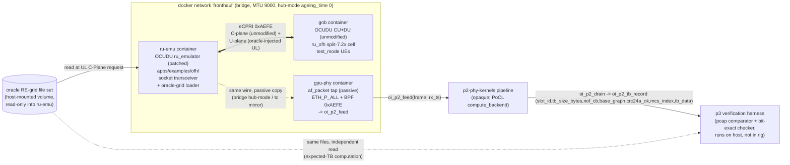
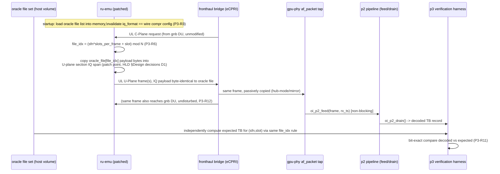

# p3-live-tap-ul-inject — HLD

> Pins: OCUDU `release_26_04` (`gitlab.com/ocudu/ocudu`, BSD-3-Clause-Open-MPI). `ru_emulator` at
> `apps/examples/ofh/` (moved from srsRAN's `tests/integrationtests/ofh/`), namespace `ocudu`.
> Local verified clone: `third_party/ocudu`. Authority: SPEC.md (this feature), `ARCHITECTURE_v3_SIM.md`
> §2/§3/§4 (P3 row), `research/ocudu_repin.md`, `SRSRAN_LIMITATIONS.md` §4/§5 (DEV-044).

## Context diagram

Only `ru-emu` (patch) and `gpu-phy` (new `ingest_backend`) carry project code. `gnb`/`5gc` are
byte-for-byte the P1 rig, undisturbed (P3-R4, P3-R12).

## Components

1. **Patched `ru_emulator`** (`apps/examples/ofh/ru_emulator.cpp`, patch series against
   `release_26_04`). Adds an oracle-grid source that supplies the UL U-plane IQ payload in place of
   the existing static/random generator, gated by a new config block (default off, P3-R4). No
   change to C-plane handling, transceiver selection, or DL (P3-R5).
2. **Oracle-grid loader/source** (new code inside the ru-emu patch, plus a standalone comparator
   tool run by the harness). Loads a configured ordered list of oracle-grid files at startup,
   holds each as an in-memory raw-IQ byte buffer per (eAxC, symbol, PRB range) matching the wire's
   pinned compression format, and on each UL burst selects the file via the deterministic
   slot→file schedule (P3-R6) and copies its bytes into the outgoing frame's IQ payload span.
3. **`gpu-phy` SIM `ingest_backend`** (new: `af_packet` tap + bounded O-RAN header pre-parse).
   `SOCK_RAW`/`ETH_P_ALL` bind on the container's fronthaul interface + attached BPF filter for
   ethertype `0xAEFE`; reads frames in kernel-delivery order, records an RX timestamp
   (`CLOCK_MONOTONIC_RAW`) in its own internal log (not part of p2's ABI — LLD §Data structures),
   parses the O-RAN CUS common header + first section header just far enough to fill
   `oi_frame_desc`'s host-filled fields (`symbol_id`/`section_id`/`filter_index`/`start_prb`/
   `nof_prbs`/`slot_id` — `p2-phy-kernels` LLD §4.1 requires these to arrive host-filled; full
   RE-grid depacketization remains K1's on-device job), and calls `oi_p2_feed` (p2's concrete
   arena-offset ABI, LLD §2/§4.1). Purely passive: no transmit path, no frame mutation (P3-R8).
   Implements the same `oi_ingest` API shape p6 will implement with mlx5/dmabuf on PHYSICAL
   hardware (SPEC honesty-ledger note: only the API shape carries over; the header pre-parse is
   a SIM-and-PHYSICAL-shared step, not SIM-only — p6 needs it too, see Rejected alternatives).
4. **Rig plumbing for tap visibility**: the `fronthaul` bridge is switched to hub-mode
   (`ageing_time 0`, disables MAC-learned unicast forwarding restriction so DU-bound frames are
   flooded to `gpu-phy`'s port too) or, if that misbehaves on a host, a `tc mirred` mirror of the
   `ru-emu`↔`gnb` veth pair onto `gpu-phy`'s veth (D-decision below).
5. **Verification tooling** (host-side, not in any container): pcap byte-comparator (injected
   U-plane payload vs oracle file, P3-U1), live bit-exact harness (drains `oi_p2_drain`,
   compares vs independently-computed expected TB, P3-I1), DU-undisturbed checker (reuses P1's
   KPI/log-diff baseline, P3-R12).

## Interfaces

| Interface | Direction | Shape | Defined in |
|---|---|---|---|
| Oracle RE-grid file(s) | oracle author → ru-emu loader, and → harness | byte-precise file format, one file per distinct slot payload, ordered list in config | LLD §3.1 |
| ru_emulator YAML config extension | operator → ru-emu | new `oracle_injection` block (enable flag, file list, eAxC binding) | LLD §4 |
| `oi_p2_feed`/`oi_frame_desc` | gpu-phy tap → p2 pipeline | `oi_p2_feed(pipeline, slot_id, arena_offset, len)` against a host-filled `oi_frame_desc` (arena_offset, frame_len, slot_id, symbol_id, section_id, filter_index, start_prb, nof_prbs — no timestamp field) — **exact name/shape owned by p2-phy-kernels LLD §2/§4.1; p3 fills the descriptor via its own header pre-parse (Components #3) and consumes the ABI as given** | p2-phy-kernels LLD §2/§4.1 |
| `oi_p2_drain` | p3 harness ← p2 pipeline | yields `oi_p2_tb_record`: `slot_id, tb_size_bytes, nof_cb, base_graph, crc24a_ok, mcs_index, tb_data` (no `sfn`/`rnti`/`harq_id` — MVP pins these to constants; harness derives `sfn` from `slot_id`, treats `rnti`/`harq_id` as fixed config) | same — opaque, p3 is a consumer only |
| `oi_ingest` common API | p6 (PHYSICAL) mirrors this shape | same three-call signatures (`_open_*`/`_poll`/`_close`) as p3's af_packet implementation, different transport and `_open_*` constructor; **the O-RAN header pre-parse step is shared vocabulary too** — p6's mlx5/dmabuf ingest needs the identical `oi_frame_desc` fields filled, whether the parse happens on-host (SIM) or on-NIC/on-host-before-DMA (PHYSICAL) | LLD §2 (p3's SIM implementation only; the API contract itself is shared vocabulary, SIM §3) |
| pcap comparator CLI | harness invocation | reads bridge pcap + oracle file set, emits mismatch count | LLD §6 |

p3 does **not** name or redefine `oi_p2_feed`/`oi_p2_drain`/`oi_frame_desc` — those names and byte
layouts are owned by `p2-phy-kernels` LLD §2/§4.1; this HLD states p3's dependency on them exactly
as p2 defines them (corrected this pass — an earlier draft treated the shape as fully opaque and
invented a placeholder signature; p2's LLD now exists and is the concrete, binding definition).

## Data flow

## Deployment view

Per `ARCHITECTURE_v3_SIM.md` §2 container topology (identical on WSL2 and the GCP `n2-standard-16`
VM, SIM §1):

- **`ru-emu`** — same image lineage as P1 (`docker/Dockerfile`, `COMPONENT=ru-emulator`), rebuilt
  from the patch-series-applied source tree; single-homed on `fronthaul`; `cap_add: NET_RAW`
  (already required for socket transceiver af_packet TX/RX, unchanged by this feature); new
  read-only bind mount for the oracle file set volume.
- **`gnb`** — byte-identical to P1's service definition. No new mounts, no new capabilities, no
  config change beyond what P1 already requires (P3-R4/P3-R12 depend on this).
- **`gpu-phy`** — from `p0-rig-scaffold`'s image (PoCL); joins `fronthaul` with `cap_add: NET_RAW`
  for the af_packet tap (SIM §2: "`ru-emu` and `gpu-phy` join `fronthaul` with `cap_add: NET_RAW`");
  consumes p2's pipeline as an in-process library/link, not a separate container (p2's SPEC states
  the pipeline runs inside `gpu-phy`).
- **`5gc`** — untouched, not on `fronthaul`, no role in this feature.
- Verification tooling runs on the **host** (or a tooling container with read-only `docker exec`/
  pcap access), never inside a rig container — mirrors P1's assertion-tooling placement.
- Definition of done: both P3-U1..U3 and P3-I1 green on WSL2 **and** the GCP VM (SPEC.md
  Acceptance gates).

## Design decisions (with rationale)

- **D1 — Patch point: `ru_emulator.cpp`'s `generate_ul_uplane_messages()` (member of class
  `ru_emulator`, `apps/examples/ofh/ru_emulator.cpp:690-714`), fed by a new oracle-grid source
  replacing `fill_random_data()`/`generate_test_data()` (`ru_emulator.cpp:178-184`,
  `:227-293`).**
  Verified from source: at construction, `generate_test_data()` pre-builds, once, a
  `std::vector<eaxc_buffers> test_data` — per UL eAxC, per OFDM symbol, per Ethernet-frame-split —
  where the header region is filled deterministically (`set_static_header_params`) and the
  **payload region is filled by `fill_random_data()`** (`std::mt19937` seeded by
  `ul_eaxc[port] + symbol`) exactly once and never touched again. At runtime,
  `generate_ul_uplane_messages()` (invoked from `process_new_frame()` whenever a UL C-Plane
  request arrives from the DU) only overwrites **header** fields via
  `set_runtime_header_params()` (slot/symbol/seq_id) before calling `transceiver.send()` — the IQ
  **payload bytes are the same random buffer, every slot, forever**. This is the exact mechanism
  SPEC.md and `SRSRAN_LIMITATIONS.md` §4 (DEV-044-pattern) describe as "static UL IQ... reused
  every slot."
  The patch therefore does two things: (a) at startup, load the oracle file set into memory
  instead of/in addition to the random fill (headers stay built the same way — only the payload
  source changes); (b) inside `generate_ul_uplane_messages()`, before `transceiver.send()`, replace
  the fixed payload copy with a **per-invocation** copy selected by the deterministic slot→file
  rule (P3-R6), using `message_info.symbol_point.get_slot().sfn()` /
  `.slot_index()` — both already available at this call site with no new plumbing. This is the
  minimal-diff point that satisfies P3-R2 (source every UL section from an oracle file),
  P3-R5 (touches neither C-plane generation, at `process_new_frame`/`decode_rx_message`, nor DL
  paths, which have no analogous UL-payload call), and P3-R6 (the slot value the schedule needs is
  already in scope here, not reconstructed).
- **D2 — Patch above the transceiver abstraction, not inside it.** `generate_ul_uplane_messages()`
  calls `transceiver.send(frame_burst)` through the `ru_emulator_transceiver` interface
  (`ru_emulator_transceiver.h`), which is implemented identically by both
  `ru_emu_socket_transmitter::send()` and `ru_emu_dpdk_transmitter::send()` — both just take
  `span<span<const uint8_t>>` and hand it to the wire. The oracle-injection patch never touches
  either transceiver file. This keeps it consistent with `p1-ran-baseline` HLD D2 (socket
  transceiver chosen for the SIM tier — no `dpdk_config`, no hugepages/EAL, first-class WSL2): p3
  runs on the same socket-transceiver `ru-emu` service P1 already stood up, unchanged in that
  respect. DPDK stays PHYSICAL-only (p6), as p1 already decided.
- **D3 — Oracle-grid substitution, not gNB-side injection.** Considered patching `gnb`'s PUSCH
  chain to inject known data pre-decode instead of patching `ru_emulator`'s UL generator. Rejected:
  it would prove the injected bytes reach an *internal* function call inside the DU binary, not
  that they crossed the wire as real eCPRI/O-RAN U-plane — exactly the ZMQ-mode failure mode
  `SRSRAN_LIMITATIONS.md` §3 already flags as "wrong layer" for this project (no split-7.2x
  boundary exposed on the wire). Injecting at `ru_emulator` keeps the RU↔DU boundary real and
  puts oracle data exactly where `gpu-phy`'s tap needs to see it: on the wire.
- **D4 — Startup validation of `iq_format`, not silent re-encode (P3-R3).** `ru_emulator`'s
  existing compression config (`compr_params.data_width` / `compr_params.type`, driven by
  `--compr_method_ul`/`--compr_bitwidth_ul`, default `bfp`/9-bit) is compared against the oracle
  file set's declared `iq_format` at startup; on mismatch the patch fails fast with a structured
  error rather than transcoding. Rationale: transcoding would silently break the byte-identical
  wire claim (P3-R3) the whole feature exists to make. MVP pins uncompressed 16-bit
  (`SUPPORTED_UL_CMPR_HDR[0] = 0x00`, confirmed in source) matching p2's MVP config
  ("OFH U-plane... static, uncompressed 16-bit IQ").
- **D5 — Bridge hub-mode as the primary tap-visibility mechanism, `tc mirred` as fallback.**
  Docker bridges default to normal Linux-bridge MAC-learning, which would forward DU-bound unicast
  frames only to `gnb`'s veth, not to `gpu-phy`'s — the tap would see nothing (P3-R9 would fail
  silently). Hub-mode (`ageing_time 0`) is the lower-effort fix (one bridge attribute, matches
  compose's declarative style, no per-interface qdisc state); `tc mirred` egress/ingress mirror is
  the documented fallback if a host's bridge driver doesn't cooperate with the ageing-time trick
  (e.g., some WSL2/GCP bridge-netfilter interactions). Both are host/rig configuration, not code —
  captured as an explicit gap: **this topology has no PHYSICAL analogue** (on hardware, the ingest
  owns its own port/flow-rule, p6) — only the `oi_ingest` API shape survives the transition
  (SPEC.md honesty-ledger, restated here because it shapes D5).
- **D6 — af_packet, not raw promiscuous DPDK, for the SIM `ingest_backend`.** Matches the backend
  contract table (SIM §3: `ingest_backend` = "af_packet/socket RX on bridge + memcpy" at SIM tier);
  mechanism-homologous with `ru-emu`'s own socket transceiver (D2) — one wire discipline across
  P1/P3, no privileged mode beyond `NET_RAW`, no hugepages. DPDK/dmabuf ingest is p6's PHYSICAL
  deliverable, not SIM's.
- **D7 — Upstream-contribution note (stretch).** OCUDU accepts merge requests (unlike the old
  AGPL srsRAN Project, which this project can only port from, never contribute to under its own
  BSD-3 obligations — `research/ocudu_repin.md` §0.1). Because D1's patch is config-gated and
  default-off (P3-R4 requires behavioral identity with injection disabled), it is structured as a
  clean, self-contained diff suitable for upstreaming as-is: no behavior change to any existing
  code path when the new config block is absent. This is a stretch deliverable (SPEC.md "In
  scope"); no gate in this feature depends on upstream acceptance.

## Rejected alternatives

- **Push `oi_frame_desc`'s O-RAN header fields (`symbol_id`/`section_id`/`filter_index`/
  `start_prb`/`nof_prbs`) onto K1 instead of parsing them in ingest** — rejected because
  `p2-phy-kernels` LLD §4.1 explicitly documents `oi_frame_desc` as **host-filled, device-read**:
  the ABI boundary itself puts this parsing on the host side of I1, not inside K1's on-device
  work. Duplicating a second, on-device header-parse path (reading raw arena bytes to re-derive
  what the descriptor already carries) would be redundant work and a second place for the O-RAN
  CUS field offsets to drift out of sync. Ingest does a *bounded* pre-parse (common header + first
  section header only); K1 still owns full RE-grid reassembly from the payload region the
  descriptor points to — the division of labor p2's own ABI already implies.
- **Carry the RX timestamp inside `oi_frame_desc` or as an `oi_p2_feed` argument** — rejected
  because `p2-phy-kernels` LLD §4.1's 32-byte descriptor has no timestamp field (its 8 reserved
  bytes are earmarked for "future eAxC/VLAN/BFP fields," not timing) and kernels have no use for
  wall-clock time. Keeping the RX timestamp in ingest's own local log (LLD §Data structures)
  satisfies P3-R10 without requesting an ABI change to an already-reviewed, clean p2 spec.
- **Inject inside `gnb` (DU) instead of `ru_emulator`** — see D3. Proves an internal-call-level
  fact, not a wire-level one; the whole point of P3 is a *live tap of real eCPRI carrying known
  data*, which requires the known data to originate RU-side.
- **Full SDR/RF loopback (real UE ↔ real RU hardware) instead of `ru_emulator` injection** — this
  is exactly the path `research/phase1_feasibility_cloud_hw.md` §2.3 and
  `SRSRAN_LIMITATIONS.md` §4 already ruled out for cloud/SIM: no open tool gives a live,
  protocol-attached UE through eCPRI without RF hardware, and SDRs are out of cloud scope (M6
  stretch, PHYSICAL-only territory). `ru_emulator` + oracle injection is the only mechanism that
  gets real eCPRI framing *and* known data without exotic hardware, at SIM tier, today.
- **ZMQ radio backend (srsRAN_4G/srsUE) as the "real data" source** — wrong layer for this project
  (`SRSRAN_LIMITATIONS.md` §3 table): ZMQ carries baseband IQ between an integrated DU+RU process
  and a UE process, with no O-RAN split and no eCPRI on any wire — it cannot exercise the
  split-7.2x boundary this feature (and `gpu-phy`'s tap) need to observe.
- **DPDK transceiver for `ru-emu` in this feature** — see D2/D6; would diverge from p1's already-
  running service, add hugepage/EAL host requirements SIM is designed to avoid (SIM §1), and is
  PHYSICAL-tier scope (p6), not SIM.
- **Re-encode/transcode the oracle file to match whatever compression `ru_emulator` happens to be
  configured with** — see D4; rejected because a silent re-encode breaks the byte-identical wire
  claim that is this feature's core proof (P3-R3), replacing a hard invariant with a soft one.
- **Promiscuous mode on `ru-emu`'s own interface as the tap mechanism** (instead of a separate
  `gpu-phy` tap + bridge hub-mode) — conflates the RU-emulator's own send/receive socket with the
  tap point and would require `gpu-phy` to share `ru-emu`'s network namespace, defeating the
  "passive, non-participating observer" property (P3-R8) and the separation of concerns between
  the two containers established in SIM §2's topology.
