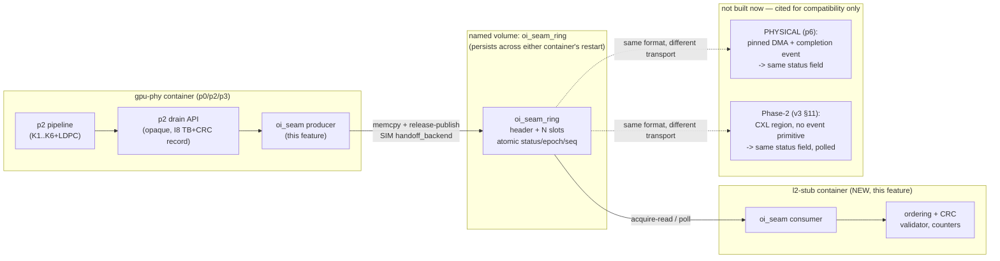

# p4-phy-l2-seam — HLD

Companion to [`SPEC.md`](SPEC.md). Requirement IDs P4-R1…R14 referenced throughout.
Precedent grounding: CXL PoC `e2e_slot_t`/`e2e_ring_hdr_t` (`/root/linux_env/cxl/E2E_LLD.md` §3.1),
cited per v3 §11 as the Phase-2 status-field discipline this ring is designed to already satisfy.

## Context diagram



## Components

| Component | Role | Reqs |
|---|---|---|
| **`oi_seam_ring` format** | Header + slot byte layout, versioned. Shared by producer and consumer. | P4-R1/R2 |
| **`oi_seam` host library** | `reserve`/`publish`/`wait_status`/`release` API (both sides link it); implements the release/acquire discipline. | P4-R3/R6/R7 |
| **Producer (inside `gpu-phy`)** | Calls p2's drain API per completed slot, `memcpy`s the TB+CRC record into a reserved slot, publishes status. | P4-R4/R6 |
| **L2 stub (`l2-stub` container, new)** | Attaches to the ring, validates ordering + CRC, exposes pass/fail counters; no FAPI encoding. | P4-R11 |
| **Ring backing store** | Named docker volume (`oi_seam_ring`), regular file, `mmap(MAP_SHARED)` — not tmpfs, not `ipc: container:X`. | P4-R10 |
| **Restart/epoch logic** | Producer bumps `epoch` on (re)init; consumer detects epoch change and resyncs; consumer persists `tail` for reattachment. | P4-R8/R9 |
| **Config schema** | Ring sizing + format version, env/YAML, cross-checked at attach. | P4-R14 |
| **Test harnesses** | Synthetic out-of-order-completion injector (ordering), slow-consumer driver (wrap), kill/respawn scripts (restart). | P4-G1/G2/G3 |

## Interfaces (every boundary named)

1. **`IF-P4-RING`** — the byte-precise ring format (LLD §Data structures): header + slot layout,
   `status` state machine, `epoch`/`seq` semantics. This is the boundary Phase-2 (CXL) and PHYSICAL
   (`p6`) must satisfy without renegotiation — the central interface of this feature.
2. **`IF-P4-API`** — the `oi_seam` C API (`reserve`, `publish`, `wait_status`, `release`) — mirrors
   the CXL PoC's `ring_reserve`/`slot_publish`/`ring_wait_status`/`ring_release` naming and ordering
   semantics almost exactly (LLD §Public APIs), deliberately, to keep the Phase-2 port a renaming
   exercise rather than a redesign.
3. **`IF-P4-L2STUB`** — the L2 stub's own CLI/verdict contract (counters, JSON verdict line,
   exit-code convention shared with p0/p1/p3) — what `p5-one-command-rig`'s suite wraps for P4-G4.
4. **`IF-P4-BACKING`** — the shared-volume mount contract (`oi_seam_ring` volume, fixed mount path
   in both containers) — what a PHYSICAL overlay (`p6`) or a Phase-2 overlay would need to replace
   (a CXL region's `mmap`+`mbind` in place of a plain volume `mmap`, same `oi_seam_ring` format on
   top).
5. **p2/p3 boundary (consumed, not owned)** — the TB+CRC record (p2's I8) and its drain call
   shape (`sfn, slot, rnti, harq_id, crc_ok, tb_len`, TB bytes, per p3's stated minimum). Treated as
   opaque and given; not redefined here.

## Data flow

```
p3 injected UL frame ──► p2 pipeline (K1..K6+LDPC) ──► p2 drain (opaque, I8 record)
  ──► oi_seam producer: reserve(seq) ──► memcpy TB+CRC fields into slot ──► publish(READY, release)
  ──► [ring: shared volume, atomic status/epoch/seq] ──► l2-stub: wait_status(READY, acquire)
  ──► validate CRC + per-key (rnti,harq_id) ordering ──► counters ──► release(slot) (tail advances)
```

Restart branch:
```
producer (re)init ──► epoch += 1, head=tail=0 ──► first publish carries new epoch
consumer sees epoch != last_known_epoch ──► discard per-key state ──► resync from head=tail=0

consumer crash ──► respawn ──► reattach to segment (unchanged epoch) ──► resume from persisted tail
  ──► never re-reads slots ≤ persisted tail, never misses slots producer published meanwhile
  (guaranteed by P4-R7: producer blocked on a full ring rather than overwriting)
```

## Deployment view

| Where | What runs | Tier |
|---|---|---|
| WSL2 host | `gpu-phy` (producer half) + new `l2-stub` container, sharing the `oi_seam_ring` volume | SIM |
| GCP `n2-standard-16` | identical compose overlay (SIM §4 DoD: no host-kernel accident) | SIM |
| CI runner | P4-G1/G2/G3 unit gates run standalone (mock producer/consumer harnesses, no live rig needed) | SIM |
| PHYSICAL boxes (later) | same `oi_seam_ring` format; producer side becomes pinned-DMA+event (p6); backing store may become a CXL region (Phase 2, not built) | — |

## Design decisions (with rationale)

1. **D1 — Status field is a plain atomic with release/acquire discipline, not an OS event object.**
   This is the load-bearing design choice: it is the only primitive available on all three
   transports (SIM memcpy, PHYSICAL DMA+event, Phase-2 CXL+poll). An OS completion event (eventfd,
   futex wake, GPU-API event) MAY be layered **on top** as a latency optimization in
   event-capable backends, but the consumer's correctness path must never depend on receiving it —
   it must always be safe to fall back to polling the same atomic. This directly implements the
   assignment's requirement and is exactly the CXL PoC's `e2e_slot_t` discipline (status flipped
   with release after payload write; read with acquire before payload read) — cited, not
   reinvented, per v3 §11.
2. **D2 — Named, volume-persisted backing store, not `/dev/shm` tmpfs, not `ipc: container:gnb`.**
   A container-local tmpfs is wiped on container recreation, making the restart gate (P4-G3)
   untestable in the interesting case; `ipc: container:X` ties the segment's lifetime to one
   named container, coupling gpu-phy's and l2-stub's restart independence. A named volume +
   `open()`/`ftruncate()`/`mmap(MAP_SHARED)` on a regular file survives either container's
   independent restart — and is structurally identical to the CXL PoC's `cxl_region_open()`
   (`shm_open`+`ftruncate`+`mmap`, optionally `mbind` to a NUMA/CXL node). The Phase-2 port of this
   feature is therefore "add `mbind`", not "redesign the attach path" — direct evidence for P4-R5.
3. **D3 — Producer-side reordering guarantee, single global ring (not per-key lanes).** P4-R6
   requires per-`(rnti,harq_id)` order even under out-of-order completion. Rather than one physical
   ring per key (dynamic lane count, harder restart/discovery story, and unneeded for the MVP's
   single-UE/single-HARQ-process shape), the producer is required to serialize insertion per key
   internally (holding a completed-out-of-turn TB in a small producer-side reorder buffer until its
   predecessor for that key has been inserted) before it ever calls `reserve`. The ring itself
   stays a single dumb FIFO; consumers never reorder. Revisit if/when concurrent multi-UE,
   multi-slot-in-flight scheduling makes the producer-side buffer large (LLD Open questions).
4. **D4 — L2 stub is new project code, not an extension of the real `gnb` container.** SIM §4's P4
   row phrasing ("L2 stub" then "DU integration point") and p1 HLD D1's note that DU-process
   isolation is "re-evaluated in p4's spec" both point the same way: proving the seam contract
   needs only a minimal consumer, not real OCUDU MAC surgery. Real DU integration stays future work
   — keeps this feature's blast radius on p0/p2/p3 to one additive volume mount on `gpu-phy` plus
   one new container.
5. **D5 — Real packed-FAPI rejected as an implementation target; SCF FAPI 222 is a semantics
   reference only.** Confirmed in prior research (`research/use_case_classification.md` line 60;
   `research/simulator_use_case_matrix.md` UC11): "real packed-FAPI is commercially gated in
   srsRAN/OCUDU." Building toward it would target a spec whose reference implementation is not
   available in the project's open-source base — recorded exactly as instructed (see Rejected
   alternatives).
6. **D6 — 4-state status enum, mirroring `e2e_slot_t`'s cardinality but collapsed to one
   producer stage.** The CXL PoC's `SLOT_EMPTY→INUSE→READY_LLR→READY_TB→DONE` spans three
   processing stages (M3/M4/M5). This seam has one producer stage (TB+CRC only), so the ring uses
   `EMPTY(0) → RESERVED(1) → READY(2) → DONE(3)`: `RESERVED` marks "producer is writing, not yet
   safe to read"; `READY` is the release-published, consumer-safe state; `DONE` is set by the
   consumer immediately before `release()` — giving a restart-time observer a way to distinguish
   "genuinely free" from "was consumed, tail not yet advanced," which sharpens the P4-G3(b)
   reattachment story (P4-R9).

## Rejected alternatives

- **Real packed-FAPI (SCF FAPI 222 wire encoding) as the seam.** Rejected: commercially gated in
  srsRAN/OCUDU open source (D5, confirmed research finding) — no legally usable open reference
  implementation exists to build against. SCF FAPI 222 remains a semantics reference only (field
  shapes: TB, CRC, HARQ process, slot/UE indices — informed this ring's slot fields).
- **Sockets or pipes as the primary transport.** Rejected: v3 §7 allows "shared-memory ring or
  socket," but a socket has no analogue on a raw CXL region (you cannot `recv()` on CXL memory) —
  picking sockets now would make the Phase-2 swap a redesign, not a transport substitution,
  directly contradicting the assignment's compatibility goal.
- **GPU-API completion events as the sole correctness primitive.** Rejected: v3 §11 states plainly
  that raw CXL memory has no completion-event primitive; making correctness depend on one would
  make this feature already incompatible with its own stated Phase-2 precedent (D1).
- **`pthread` process-shared mutex/condvar synchronization instead of lock-free atomics.** Rejected:
  `PTHREAD_PROCESS_SHARED` mutexes need the robust-mutex extension to survive a holder's crash
  cleanly; plain atomics with release/acquire avoid the recovery problem entirely and match the
  CXL PoC precedent, which uses raw atomics, not locks.
- **One physical ring per `(UE, HARQ process)` key.** Rejected for the MVP (D3): dynamic lane count
  and discovery/restart complexity for zero present benefit (MVP is single-UE, single-HARQ,
  `rv=0`-only per p2's fixed config) — revisit only if scaling motivates it.
- **`ipc: container:gnb`-style namespace sharing for the ring.** Rejected (D2): couples the ring's
  lifetime to one named container, defeating the independent-restart gate (P4-G3) and diverging
  from the CXL PoC's named-segment precedent.
