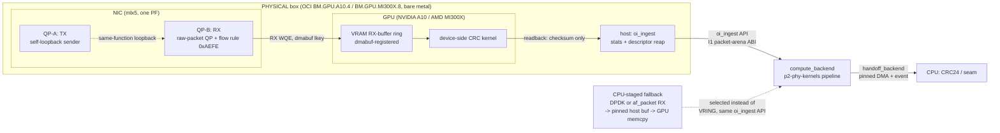

# p6-physical-m1-ingest — HLD

**Scope:** design of the day-1 probe suite, the M1 spike harness, and the production
`ingest_backend` (PHYSICAL implementation + CPU-staged fallback) ([`SPEC.md`](SPEC.md)).
Backend contract: [`ARCHITECTURE_v3_SIM.md`](../../../ARCHITECTURE_v3_SIM.md) §3 (normative).
M1 chain evidence: [`research/physical_deep_feasibility.md`](../../../research/physical_deep_feasibility.md) §1.

## 1. Context diagram

## 2. Components

| Component | Kind | Notes |
|---|---|---|
| `probe_suite` | 10 standalone C/shell probe programs | day-1 checklist R1–R10; each independent, run in fixed order, log PASS/FAIL/recorded-value to a per-box report |
| `m1_spike_harness` | 5-step probe program sequence | deep-feasibility §1.1 order; steps share process/QP state within a step but each step is independently re-runnable |
| `ingest_backend` (VRAM-ring impl) | production library | `oi_ingest` API, dmabuf-backed ring; the PHY-1 mechanism, made durable |
| `ingest_backend` (CPU-staged impl) | production library | same `oi_ingest` API; DPDK/af_packet RX → pinned host buffer → explicit GPU memcpy; the freeze-breaker's permanent form |
| `wiring_selector` | config + probe glue | maps deep-feasibility §3 priorities 0–4 to a chosen sender-side wiring, independent of which `ingest_backend` impl is active |
| `l2fwd_nv_crosscheck` | third-party binary (unmodified) | NVIDIA-only, run alongside the spike as a known-good validator (R15) — not part of `oi_ingest` |
| `stats_exporter` | counters surface | frames seen/matched/delivered/dropped, exposed by both `ingest_backend` impls identically |
| `latency_recorder` | measurement-only tooling | dmabuf reg time, QP setup time, byte-landing latency, throughput sweep — feeds R27, never a gate input |

## 3. Interfaces (every boundary named)

| # | Boundary | Producer → Consumer | Form |
|---|---|---|---|
| B1 | **`oi_ingest` API** | `ingest_backend` (either impl) → `compute_backend` orchestration | C API, LLD §2 — the SIM/PHYSICAL swap point, first named in p3 (SIM af_packet impl), this feature is its PHYSICAL implementation(s) |
| B2 | **packet arena + descriptor ring (I1)** | `ingest_backend` → p2 pipeline K1 kernel | device buffer of raw Ethernet frames + descriptors; owned by p2's ABI (HLD ref: `p2-phy-kernels` HLD §3 I1) — p6 supplies the allocator (VRAM dmabuf region vs. pinned host buffer) and the descriptor writer only |
| B3 | **dmabuf fd export** | GPU runtime (CUDA open-modules / ROCm) → `ibv_reg_dmabuf_mr` | `cuMemGetHandleForAddressRange` / `hsa_amd_portable_export_dmabuf`, vendor-specific, wrapped behind one internal function per vendor |
| B4 | **flow-steering rule config** | `wiring_selector` / operator config → NIC (`ibv_create_flow`) | ethertype match (0xAEFE) minimum; extensible to 5-tuple for wiring modes ≥3 |
| B5 | **wiring-mode selection** | operator config → `wiring_selector` → (sender-side setup, out of `oi_ingest`'s scope) | config value, priority 0–4, each with its own precondition probe (SPEC R22–R26) |
| B6 | **stats/counters query** | `ingest_backend` → operator/CI harness | `oi_ingest_get_stats`, same shape both impls |
| B7 | **measurement record** | `latency_recorder` → honesty ledger / paper docs | append-only record format, LLD §3.4 — never read by any PASS/FAIL gate |
| B8 | **`handoff_backend`** (unchanged, referenced not owned) | `compute_backend` → CPU CRC/seam | pinned-buffer async DMA + completion event (v3 §5); p6 invokes it at the pipeline's exit, does not redesign it |

## 4. Data flow

### 4.1 Day-1 probe suite (R1–R10)

Sequential, fail-fast on R2/R6 (hard gates), soft-continue on R4/R7/R9 (recorded, non-fatal):
R1 (NIC ident) → R2 (dmabuf MR) → R3 (raw QP, host-RAM) → R4 (SR-IOV VF probe) → R5 (hugepages/DPDK)
→ R6 (GPU + LDPC suite) → R7 (BAR1, NVIDIA) → R8 (open-kernel-modules, NVIDIA) → R9 (sriov_numvfs
probe) → R10 (self-loopback smoke test). Output: one per-box report consumed by PHY-0's gate.

### 4.2 M1 spike (deep-feasibility §1.1, exact order)

1. dmabuf MR probe (chain links 1–3) — no NIC traffic.
2. Raw QP + flow rule, **host-RAM MR**, self-loopback flags — chain links 5–7, zero GPU.
3. Swap host-RAM MR → dmabuf MR, same QP — chain link 4, **the M1 moment**.
4. Device-side CRC kernel computes a checksum over the landed VRAM buffer; host reads back only
   the checksum (small) and compares to the sender's precomputed value — byte-verification without
   reading the payload back over PCIe (that would defeat the point of landing it in VRAM).
5. (Parallel, NVIDIA-only) `l2fwd-nv` runs against the same frame stream as an independent
   mechanism validator.

Only after all five: `ru_emulator` becomes the real sender (PHY-2 wiring, out of this feature's
PHY-1 gate but the same `ingest_backend` code path).

### 4.3 Production path (steady state, either impl)

`oi_ingest_init(config)` reads the wiring mode + impl-selection config once → allocates the ring
(VRAM dmabuf region, or pinned host buffers for CPU-staged) → `oi_ingest_start` installs the
flow-steering rule → steady state: NIC (or CPU-staged DMA copy) lands frames in the arena, host
reaps descriptors via `oi_ingest_poll`, hands the descriptor batch to `compute_backend` across B1 —
**identical call shape regardless of which impl is behind it.**

## 5. Deployment view

| Element | Where | Tier |
|---|---|---|
| Day-1 probes, M1 spike harness | bare-metal host process on Stage-A (`BM.GPU.A10.4`) first, re-run unmodified on Stage-C (`BM.GPU.MI300X.8`) at PHY-4 | PHYSICAL only — no container (needs `/dev/infiniband`, hugepages, raw NIC access; matches PHYSICAL §1 bare-metal requirement) |
| `ingest_backend` (both impls) | linked into the same `gpu-phy`-equivalent process that hosts `compute_backend` on PHYSICAL boxes; SIM's `gpu-phy` container gets the af_packet impl instead (p3), same image lineage per p0 | PHYSICAL implementation runs unprivileged-container-incompatible (needs `/dev/infiniband`, `/dev/kfd` or NVIDIA device nodes, `CAP_NET_RAW`/`CAP_SYS_RAWIO` for flow steering) — bare-metal process or a privileged container with device passthrough, per PHYSICAL §1/§2 |
| `l2fwd_nv_crosscheck` | separate unmodified upstream build, run alongside, NVIDIA boxes only | PHYSICAL, Stage-A only |
| `wiring_selector` config | per-box config file, read once at spike/production start | PHYSICAL |
| Measurement records | appended to the paper/results doc lineage (same convention as prior CXL PoC `RESULTS_SUMMARY.md`) | PHYSICAL only — never SIM |

Bare-metal specifics required: isolated cores + hugepages (DPDK/CPU-staged path), open NVIDIA
kernel modules (`nvidia-open`, NVIDIA boxes only), kernel ≥5.12 for `ibv_reg_dmabuf_mr` (GPU
Operator recommends ≥6.1 + rdma-core ≥44), rdma-core with mlx5dv self-loopback support.

## 6. Design decisions

| ID | Decision | Rationale |
|---|---|---|
| **D1** | **Same-function raw-QP self-loopback (priority 0) is the M1 mechanism**, not SR-IOV VF loopback as originally planned in `ARCHITECTURE_v3_PHYSICAL.md` §2. | deep-feasibility §1 finding #1: `MLX5DV_QP_CREATE_TIR_ALLOW_SELF_LOOPBACK_UC/_MC` is documented, needs only the PF — removes the M1 spike's dependency on own-VF creation, which is unverified on OCI bare metal (§3 correction: BM secondary VNICs are Oracle-assigned VLANs, not customer VFs). This narrows M1 to exactly the one unproven link (chain link 4) instead of conflating it with an unrelated wiring risk. |
| **D2** | **Verbs (`ibv_reg_dmabuf_mr` + raw-packet QP), not DPDK-gpudev-only, for the ingest mechanism** — DPDK gpudev remains a cross-check tool (R15), not the production path. | DPDK gpudev's CUDA driver is the only one that exists (deep-feasibility §4) — no ROCm gpudev driver. Since the thesis requires an AMD leg (PHY-4 graduation), a DPDK-gpudev-only design would structurally exclude AMD. The verbs path works identically for both vendors (same `ibv_reg_dmabuf_mr` call, vendor difference is only in the dmabuf-export step, B3) — **required for AMD, not just preferred**, per deep-feasibility §4. |
| **D3** | **One `oi_ingest` API, two implementations, config-selected** — not two APIs, not a compile-time branch. | Direct requirement from the SIM §3 backend contract and from p2 HLD D10 ("p6 swaps only the arena's allocator and the descriptor writer"); also the only way R21's swap test (build compute_backend once, run against either impl) is possible. |
| **D4** | **Freeze-breaker is a first-class code path, not a "if all else fails" escape hatch bolted on later.** The CPU-staged implementation is designed, built, and API-matched *before* it's known whether it will be needed, on the same schedule as the VRAM-ring implementation. | The bounded 2-week spike window (SPEC R16) only works as a real deadline if the fallback is ready to flip to, not a research project of its own started under time pressure. This mirrors the CXL PoC's prior lesson (per user's own project history) that undemonstrated fallbacks tend to become silent scope cuts if not built in parallel. |
| **D5** | **Byte-verification reads back a checksum, not the payload**, from VRAM. | Reading the full payload back over PCIe to compare on the host would (a) add a copy the production path never does, silently changing what's being measured, and (b) make the "landed in VRAM" claim partially untested (a bug that corrupts data after the CRC kernel reads it, but before a hypothetical readback, would be masked). A device-side CRC kernel operates on exactly the bytes the compute_backend will consume. |
| **D6** | **`l2fwd-nv` cross-check runs in parallel with our path, not as a gate on it.** | It validates the box/driver/silicon, not our code; treating a passing l2fwd-nv as sufficient for PHY-1 would silently substitute NVIDIA's DPDK-gpudev mechanism for our verbs mechanism, which is a different (and for AMD, unavailable) code path. Keeping it a side-channel debugging aid preserves the actual PHY-1 claim (SPEC honesty-ledger). |
| **D7** | **Wiring-mode selection is explicit config, not runtime auto-probing/negotiation.** | Each priority (0–4) has a distinct precondition (self-loopback flags, mlx5 bifurcation devarg, own-VF creation, OCI L2 VLAN, plain UDP) that must be verified once per box and then pinned — auto-negotiating between them at runtime would hide which mechanism is actually carrying traffic, undermining the honesty-ledger discipline the whole project runs on. |

## 7. Rejected alternatives

| Alternative | Why rejected |
|---|---|
| **DOCA GPUNetIO / GDAKI** (GPU rings the NIC doorbell itself) | v3 §4 already established CPU-posted receives are sufficient for correctness — GDAKI is a control-plane latency optimization, not a capability gap. deep-feasibility §4 additionally confirms the open DOCA GPUNetIO cut is RDMA-RC-only (no Ethernet receive), so it isn't even a candidate mechanism for this feature's raw-Ethernet-QP requirement — not needed, and not usable as-is even if wanted. |
| **DPDK-gpudev-only ingest** (skip verbs entirely, use l2fwd-nv's mechanism as the production path) | Excludes AMD by construction (no ROCm gpudev driver, D2); would also make the "open, vendor-neutral NIC→VRAM path" claim NVIDIA-specific, contradicting the thesis. Kept only as the R15 cross-check. |
| **SR-IOV VF pair as the M1 wiring mechanism** (the original `ARCHITECTURE_v3_PHYSICAL.md` §2 plan) | Superseded by D1: adds an unverified OCI-bare-metal dependency (own-VF creation) to the one part of the plan (M1) that most needs to be de-risked; demoted to wiring priority 2, still available for PHY-2 where its extra realism (real VF/eswitch data plane) is actually useful. |
| **Auto-detecting/negotiating wiring mode at runtime** | See D7 — rejected in favor of explicit, once-probed, pinned config. |
| **cl_khr_external_memory import path for dmabuf** | phase1 §2.4: import-only and unevenly supported (AMD ROCm OpenCL support unconfirmed); sidestepped entirely by allocating with the native runtime (CUDA/HIP) and exporting, never importing — consistent with p2's compute_backend design, not re-litigated here. |
| **Reading the full VRAM payload back to the host for verification** | See D5. |
| **Building the CPU-staged fallback only after M1 fails** | See D4 — timeline risk to the freeze-breaker's entire purpose. |
